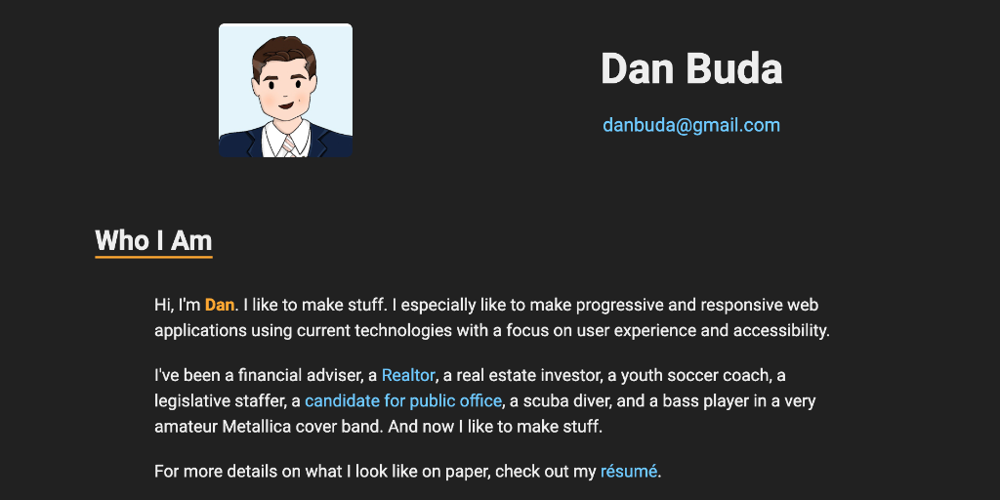

# Dan Buda's Portfolio

<kbd></kbd>

The newest iteration of my development portfolio. Unlike my [previous version](https://github.com/DanBuda11/portfolio-old) which was a single page app built with React and webpack with different pages for projects and what I build stuff with, I wanted this version to be much simpler, focusing more on design.

This is made with one HTML file and one Sass file, on a simple [gulp framework I made](https://github.com/DanBuda11/gulp-framework) that compiles Sass to CSS, and minifies everything. [Cloudinary](https://cloudinary.com/) is used to handle images.

It's fully responsive, and like everything I make, is tested for performance and accessibility using the [Lighthouse](https://developers.google.com/web/tools/lighthouse/) audits in Chrome developer tools, [axe](https://www.deque.com/axe/), [webhint](https://webhint.io/), and [Google PageSpeed Insights](https://developers.google.com/speed/pagespeed/insights/).

The Sass/CSS part of the site includes a lot of Flexbox to handle layout and responsive design, a few `@media` queries where necessary, and the use of CSS custom properties to make it easier to change color schemes if desired.

Feedback is always welcome!
